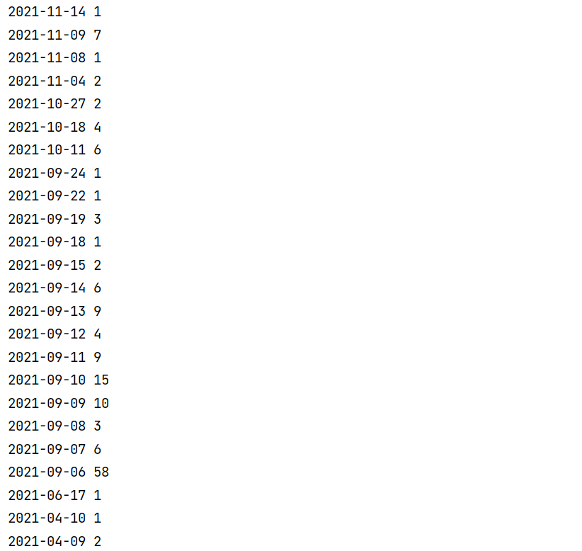

## API, ДЗ 

Статистика по количеству правок статьи об *Александре Градском*:  

**28.11.2021 были совершены 153 правки. Связано это с тем, что в этот день, в возрасте 72 лет умер *Александр Борисович Градский*.**

## Корреляция 

Статистика по количеству правок статьи об *Жане-Поле Бельмондо*: 

**06.09.2021 было совершено 58 правок. Данная дата совпадает с датой смерти *Жана-Поля Бельмондо*.**

**"Можно ли пользоваться такой метрикой?" - я отвечу, что нет. Так как она не всегда сможет дать правильный ответ. Ведь не только смерть человека заставляет делать правки в статье. Правки делают и при других событиях, которые происходят с человеком.**